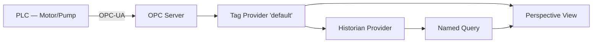

# PRP Template (Ignition-adapted)

This file is **both** the reference documentation for what a PRP must contain and the **literal template** that `scripts/new_prp.py` uses to scaffold new PRPs. The content between the `<!-- BEGIN TEMPLATE -->` and `<!-- END TEMPLATE -->` markers is copied verbatim into `<project-root>/prp/{slug}.md` with three placeholders substituted: `{{slug}}`, `{{intent}}`, `{{date}}`.

## Why this shape

Adapted from CM's `templates/prp.template.md`. Every section below has a reason — deleting a section breaks the discipline the PRP pattern encodes:

- **Goal / Why / What** answer *what are we building and why* before one line of artifact is authored. Without these, Copilot optimizes for plausibility instead of value.
- **NOT in Scope** is the single most protective section against scope creep. If you can't name what you're *not* doing, you haven't thought about the boundary.
- **All Needed Context** is what prevents hallucination. Every referenced file path must actually exist; every gotcha must be real.
- **Implementation Blueprint** is pattern references, not code. PRPs that dump 200-line code blocks stop being plans and become unreviewable drafts.
- **Validation Loop** (Level 1/2/3) is the contract for "done". Without this, "done" is whatever the executor happens to get to.
- **Final Validation Checklist** is what the execution skill re-reads before declaring completion. It's the machine-readable version of "done".
- **Anti-Patterns** is feature-specific — not framework-wide. "What would go wrong *for this feature*" that the generic anti-pattern catalogs don't cover.

## Confidence markers

Every bullet under **All Needed Context** and every row under **Implementation Tasks** must end with a confidence marker: `[HIGH]`, `[MEDIUM]`, or `[LOW]`. HIGH means ≥0.85 (verified against ground truth or existing code). MEDIUM means "reasonable but not verified" (must be confirmed before execution). LOW means "guess" (must be resolved via ambiguity escalation *before* the PRP is handed off).

A PRP that hands off with any LOW marker or any unresolved MEDIUM marker is not ready for execution.

## Section enforcement

`scripts/validate_prp.py` enforces the following as errors (PRP fails validation):

- Missing: `## Goal`, `## Why`, `## What`, `## All Needed Context`, `## Implementation Blueprint`, `## Validation Loop`, `## Final Validation Checklist`, `## Anti-Patterns to Avoid`.
- Missing subsections: `### Success Criteria`, `### NOT in Scope`, `### Level 1`, `### Level 2`, `### Level 3`, `### Implementation Tasks`.
- Any fenced code block longer than 20 lines inside the PRP body (PRPs reference patterns, not dump code).
- `### Success Criteria` without at least one `- [ ]` checkbox.
- `### NOT in Scope` that is empty.

As warnings:

- Context bullets or task rows missing a confidence marker.
- File paths cited in Context that don't exist on disk (may be a to-be-created file — warning only).

---

<!-- BEGIN TEMPLATE -->
# PRP — {{intent}}

**Slug**: `{{slug}}`
**Date**: {{date}}
**Status**: draft

## Goal

**Feature Goal**: [Specific, measurable end state — what Ignition artifacts, at which tag paths / NQ names / view paths, producing what observable behavior.]

**Deliverable**: [Concrete list of artifacts. E.g.: `Motor` UDT definition + 3 UDT instances at `[default]Plant/LineA/Motor{1,2,3}` + Named Query `production/shift_summary` + Perspective view `dashboards/ShiftSummary`.]

**Success Definition**: [How the user will know this is complete. E.g.: "operator sees current-shift production count updating every 30s on the Shift Summary view, with historical data visible for the last 7 days."]

## User Persona (if applicable)

**Target User**: [E.g., line operator, maintenance technician, plant manager, MES integrator.]

**Use Case**: [Primary scenario when this feature is used. E.g., "operator checks shift progress every 15 minutes during the shift."]

**User Journey**: [Step-by-step. Which view, which interactions, what data they see.]

**Pain Points Addressed**: [What frustration this removes. E.g., "currently operators walk to the line PLC HMI; this brings it to their tablet."]

## Why

- [Business / operational value.]
- [Integration with existing plant systems — which existing UDTs, tables, historian providers, alarm pipelines this connects to.]
- [Problems solved and for whom.]

## What

[User-visible behavior and technical requirements. Keep this crisp — specifics go into Success Criteria and the Blueprint.]

### Success Criteria

- [ ] [Specific measurable outcome 1 — e.g., "`[default]Plant/LineA/Motor1/RunStatus` reads live from PLC within 2s of tag change"]
- [ ] [Specific measurable outcome 2 — e.g., "Named Query `production/shift_summary` returns current shift totals in <500ms on 10M-row history"]
- [ ] [Add as many as are needed; each must be objectively verifiable]

### NOT in Scope

[Every deferred item needs a one-line rationale. No vague "phase 2" entries.]

- [Deferred item 1] — [Why deferred: not blocking core objective / future phase / different feature / etc.]
- [Deferred item 2] — [Why deferred]

## All Needed Context

### Context Completeness Check

_Before handing off this PRP, verify: "If a Copilot session started cold with only this PRP + the `.github/` framework + `ground-truth/`, could it build the feature without asking new clarifying questions? If not, what's missing?"_

### Documentation & References

```yaml
# MUST READ — these references must be in context before any artifact is authored.

- skill: ignition-tag-authoring
  why: [Specific workflow step or reference — e.g., "UDT Definition authoring workflow"]
  focus: [Specific patterns — e.g., "parameter inheritance", "overriding instance-level members"]
  confidence: HIGH

- skill: ignition-sql-authoring
  why: [E.g., "historian query patterns for shift-boundary time ranges"]
  focus: [E.g., "references/historian-queries.md — partition-pruning template A"]
  confidence: HIGH

- file: ground-truth/tags/UDTs.json
  why: [E.g., "shows existing Motor UDT structure that the new Pump UDT should mirror"]
  pattern: [E.g., "parameter block at line ~40, tag group naming convention"]
  gotcha: [E.g., "existing UDT uses `MotorName` parameter — new UDT must align"]
  confidence: HIGH

- file: ground-truth/sql/named-queries/production_summary.xml
  why: [E.g., "shift-boundary time-range parameter pattern already in use"]
  pattern: [E.g., "`:shiftStart` + `:shiftEnd` parameter naming"]
  confidence: HIGH

- url: https://docs.inductiveautomation.com/display/DOC81/System+Functions
  why: [E.g., "verify system.tag.readBlocking signature for 8.1"]
  section: [Specific anchor if available]
  confidence: MEDIUM

- docfile: ground-truth/sql/conventions.md
  why: [Project naming / tz / audit conventions — authoritative]
  section: [Specific section]
  confidence: HIGH
```

### Current Resource Tree

[What exists today that this feature touches. Tag paths, NQ paths, Perspective view paths, script library packages. Only list what is actually relevant — don't dump the whole project.]

```
[default]
├── Plant/
│   └── LineA/
│       ├── Motor1/   (existing, Motor UDT instance)
│       └── Motor2/   (existing, Motor UDT instance)

named-queries/
└── production/
    └── shift_summary.xml   (existing, referenced by ShiftOverview view)
```

### Desired Resource Tree — what will be added / modified

```
[default]
├── Plant/
│   └── LineA/
│       ├── Motor3/         (NEW — Motor UDT instance)
│       └── Pump1/          (NEW — Pump UDT instance, requires new UDT definition)

_types_/
└── Pump/                    (NEW UDT Definition)

named-queries/
└── production/
    └── pump_health.xml     (NEW Named Query)

dashboards/
└── LineAOverview/          (MODIFY — add Pump status panel)
```

### Known Gotchas

[Ignition-specific constraints that will bite if ignored. Only list what's relevant to THIS feature — don't replicate the framework-wide catalog.]

```
# CRITICAL: Tag history queries must use partition-aware filtering on `sqlth_partitions`
#          before joining `sqlt_data_N_M`, or the query scans every partition.
#          See skills/ignition-sql-authoring/references/historian-queries.md.

# CRITICAL: UDT parameter references inside tag expressions use {parameterName},
#          not {{parameterName}}. Designer silently accepts the wrong syntax but
#          the expression never evaluates correctly.

# GOTCHA:  Perspective binding polling rate interacts with Named Query caching —
#          set refresh rate >= 1s for production queries to avoid cache thrash.

# GOTCHA:  Jython 2.7 in Gateway scope cannot use f-strings. Use .format() or %-formatting.
```

## Implementation Blueprint

### Architecture Diagram



[Data flow, sequence of operations, or integration boundary. Only include if the feature has non-obvious integration.]

### Data Models & Artifact Shapes

**IMPORTANT**: Reference existing patterns. Do NOT dump complete tag JSON or complete SQL here — link to the pattern file and call out the specific fields that differ.

```yaml
ARTIFACTS_NEEDED:
  - Artifact: Pump UDT Definition
    similar_to: ground-truth/tags/UDTs.json — Motor UDT (starts at path `/_types_/Motor`)
    key_fields_added: [DischargePressure, SuctionPressure, FlowRate]
    parameter_changes: adds `PumpType` string parameter
    confidence: HIGH

  - Artifact: Pump UDT Instance (3 instances)
    similar_to: ground-truth/tags/UDTs.json — existing Motor instances
    placements: "[default]Plant/LineA/Pump{1,2,3}"
    parameter_values:
      - Pump1: PumpType="Centrifugal", PLCAddress="DB10.Pump1"
      - Pump2: PumpType="Centrifugal", PLCAddress="DB10.Pump2"
      - Pump3: PumpType="Positive Displacement", PLCAddress="DB11.Pump3"
    confidence: MEDIUM  # PLC addresses need verification with controls team

  - Artifact: Named Query production/pump_health
    similar_to: ground-truth/sql/named-queries/production_summary.xml
    params: [":shiftStart" DateTime, ":shiftEnd" DateTime, ":pumpId" Integer]
    type: Query
    confidence: HIGH
```

### Implementation Tasks (ordered by dependency)

```yaml
Task 1: AUTHOR UDT Definition `Pump`
  - SKILL: ignition-tag-authoring
  - FOLLOW pattern: ground-truth/tags/UDTs.json — Motor UDT definition at `/_types_/Motor`
  - DELIVERABLE: tag JSON ready to import at path `/_types_/Pump`
  - VALIDATE: run scripts/validate_tag_json.py on the output
  - CONFIDENCE: HIGH

Task 2: AUTHOR UDT Instances (Pump1, Pump2, Pump3)
  - SKILL: ignition-tag-authoring
  - DEPENDS_ON: Task 1 (UDT definition must exist before instances reference it)
  - FOLLOW pattern: ground-truth/tags/UDTs.json — Motor1/Motor2 instances
  - DELIVERABLE: 3 tag JSON instance entries
  - VALIDATE: validate_tag_json.py passes; each instance references the Pump UDT type
  - CONFIDENCE: MEDIUM  # PLC addresses pending controls-team confirmation

Task 3: AUTHOR Named Query `production/pump_health`
  - SKILL: ignition-sql-authoring
  - DEPENDS_ON: none (NQ is independent of tag creation; can be authored in parallel with Task 1)
  - FOLLOW pattern: ground-truth/sql/named-queries/production_summary.xml (parameter binding)
              +   skills/ignition-sql-authoring/references/historian-queries.md — partition-pruning template A
  - DELIVERABLE: NQ XML at named-queries/production/pump_health.xml
  - VALIDATE: validate_named_query.py + sql_lint.py (dialect: postgres)
  - CONFIDENCE: HIGH

Task 4: MODIFY Perspective view dashboards/LineAOverview — add Pump status panel
  - SKILL: (none yet — ignition-views skill not available; degrade gracefully)
  - DEPENDS_ON: Task 2 (instances must exist for binding)
  - APPROACH: flagged for manual authoring in Designer; PRP provides the binding specs only
  - CONFIDENCE: LOW (ACK: 2026-04-26 user accepted manual Designer authoring; no ignition-views skill yet)
```

### Implementation Patterns & Key Details

```yaml
# Only include patterns that are specific to THIS feature and not already in the
# domain skill references. Otherwise link to the domain skill reference.

PATTERN:
  context: "Shift-boundary parameter default"
  file: ground-truth/sql/named-queries/production_summary.xml
  focus: "NQ parameters :shiftStart / :shiftEnd use 'current shift' default via
         a server-side expression (see lines N-M of the referenced file)"
  why: "Bindings passing nulls should still get current-shift behavior, not error"
  confidence: HIGH
```

### Integration Points

```yaml
TAG_PROVIDER:
  - target: default
  - adds: `/_types_/Pump` definition + `/Plant/LineA/Pump{1,2,3}` instances
  - preserves: existing `/Plant/LineA/Motor{1,2}` — no changes

DATABASE:
  - dialect: postgres (confirmed in ground-truth/sql/conventions.md)
  - uses: existing historian tables (`sqlth_partitions`, `sqlth_te`, `sqlt_data_*`)
  - adds: none (no new DDL)

NAMED_QUERIES:
  - adds: `production/pump_health`
  - preserves: `production/shift_summary`

PERSPECTIVE:
  - modifies: view `dashboards/LineAOverview`
  - adds: binding to `production/pump_health` on a new panel
```

### Failure Modes & Error Handling

| Mode | Cause | Handling |
|---|---|---|
| Tag resolves with `BadCommunication_Timeout` | PLC address wrong in instance parameter | Verify address with controls team before deploy |
| NQ returns empty for current shift | `:shiftStart`/`:shiftEnd` defaults not computing on first load | Binding must pass explicit values or NQ must use `COALESCE` on param default |
| Historian query >2s latency | Partition not pruned (filtering on `t_stamp` but not `sqlth_partitions`) | Follow partition-pruning template A in `historian-queries.md` |

## Validation Loop

### Level 1: Structural validation (run after each artifact authored)

```bash
# Tag JSON
python .github/skills/ignition-tag-authoring/scripts/validate_tag_json.py <output>.json

# Named Query
python .github/skills/ignition-sql-authoring/scripts/validate_named_query.py <output>.xml

# SQL lint (any DDL / inline SQL in the NQ body)
python .github/skills/ignition-sql-authoring/scripts/sql_lint.py --dialect postgres <output>.xml

# Expected: exit 0 or exit 2 (warnings-only). Exit 1 = stop and fix.
```

### Level 2: Import & semantic validation (run once per artifact type after Level 1 passes)

[Concrete, artifact-specific. The executor runs these by hand in a test Designer / test gateway.]

```
# Tag import
- Import tag JSON into test gateway's tag browser
- Verify: UDT Definition appears under _types_/Pump with all members
- Verify: Each UDT Instance shows green status (no BadCommunication, no Unknown)

# Named Query validation
- Open NQ in Designer's Named Query editor
- Supply canned params: shiftStart=<a shift boundary 2h ago>, shiftEnd=<now>, pumpId=1
- Verify: returns dataset with expected columns, row count >0

# Perspective binding (manual — no skill yet)
- Open view in Designer Preview mode
- Verify: panel renders, binding resolves, no red errors in console
```

### Level 3: Runtime / performance validation (run once before declaring complete)

```
# Tag runtime
- In a live session, observe Pump1/Pump2/Pump3 RunStatus values
- Force a PLC write (controls team) and verify tag update <2s

# NQ performance
- In Designer: run EXPLAIN ANALYZE on the expanded NQ query (with real shift range)
- Verify: partition pruning visible in EXPLAIN (Bitmap Index Scan on sqlth_partitions)
- Verify: total runtime <500ms on 10M-row historian
- If slower: loop back to sql-authoring skill step 5-6 (EXPLAIN review)

# Dashboard sanity
- Open ShiftSummary view in a session for 5 minutes during an active shift
- Verify: numbers update, no red binding errors, no console warnings
```

## Final Validation Checklist

### Technical Validation

- [ ] All Level 1 validators pass (exit 0 or exit 2) for every artifact
- [ ] All Level 2 imports succeed in test gateway
- [ ] All Level 3 runtime checks pass

### Feature Validation

- [ ] All Success Criteria met and observed
- [ ] No red errors in Designer tag browser
- [ ] No red errors in Perspective session console
- [ ] Historian queries meet performance target

### Code Quality Validation

- [ ] Artifact naming matches `ground-truth/sql/conventions.md` (or project conventions doc)
- [ ] No invented field names (every field traceable to ground truth or an explicit [known unknown] marker)
- [ ] Anti-patterns from `skills/*/references/anti-patterns.md` avoided
- [ ] No hardcoded datasource names, no string-concat into db calls, no leading `%` LIKE

### Documentation & Handoff

- [ ] Every `[known unknown — verify in Designer]` item from Context has been resolved
- [ ] PRP `Status:` updated to `executed` (or `blocked` with reason)
- [ ] Any deviations from the blueprint documented with a `### Deviation` subsection

---

## Anti-Patterns to Avoid (for this feature)

[Feature-specific. Generic Ignition anti-patterns live in the domain-skill references. This section is for "what would go wrong *for this feature* that isn't already covered".]

- ❌ Don't deploy Pump instances with placeholder PLC addresses. `[default]BadCommunication_Timeout` tags break downstream bindings silently.
- ❌ Don't copy the Motor UDT structure blindly. Pump-specific members (DischargePressure, FlowRate) need their own OPC item path templates.
- ❌ Don't skip Level 3 runtime validation because Level 2 passed in Designer. Designer uses a subset of the runtime; a view that renders in Preview can still red-error in a real session.
- ❌ Don't assume `production/shift_summary` parameter defaults carry to `production/pump_health`. Copy the pattern explicitly; don't assume.
<!-- END TEMPLATE -->

---

## Notes for authors (not copied into new PRPs)

- Keep total PRP length under ~600 lines. If it's longer, the feature is too big — split.
- Resist the urge to fill sections with prose when a bullet list works. A PRP is a spec, not an essay.
- Every time you're tempted to drop a code block: ask "can I reference a pattern file instead?" If yes, do that.
- The template deliberately errs on the side of more structure than small features need. For a genuinely single-artifact change, use the domain skill directly — don't write a PRP.
